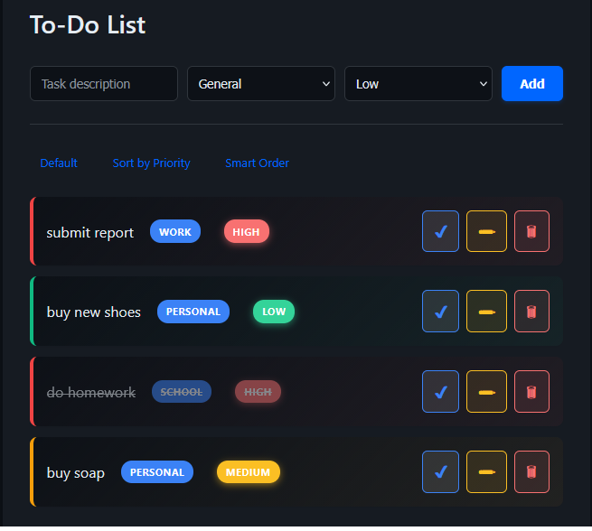
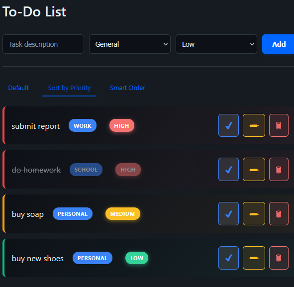
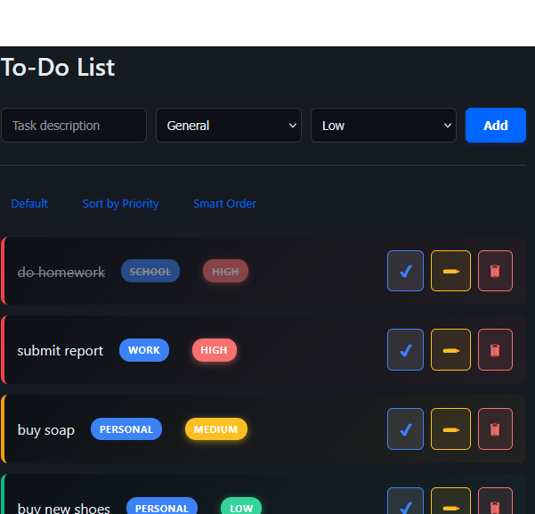

# 📝 To-Do Application

A lightweight to-do list web application built with **PHP** and **MySQL**, created to explore **data-driven task ordering** and explainable, AI-inspired decision logic in a practical setting.

---

## 🚀 Overview

This project extends a traditional CRUD-based to-do list by introducing **Smart Task Prioritization** — a sorting mechanism that evaluates tasks using multiple signals instead of relying on a single field.

Rather than filtering tasks, the system **ranks all tasks by relevance**, demonstrating how intelligent behavior can emerge from structured data and clear decision rules.

---

## ✨ Key Features

- Create, edit, and delete tasks  
- Assign categories and priority levels  
- Mark tasks as completed  
- Three task ordering modes:
  - **Default View** (latest-first)
  - **Priority-Based Sorting**
  - **Smart Order** (multi-signal ranking)

---


## 🧠 Smart Task Prioritization (What Was Implemented)

The **Smart Order** feature introduces a relevance-based ranking system.

Instead of showing tasks in a fixed or single-field order, each task is assigned a **score** computed from:

- Task priority (High, Medium, Low)
- Task category relevance (e.g., Work, School)
- Task age (older tasks receive a higher weight)

Tasks are then displayed in descending order of this computed score.

This approach allows:
- Partial matches to compete fairly
- Graceful handling of conflicting priorities
- Transparent and explainable ranking logic

> The system is intentionally heuristic-based and designed as a stepping stone toward future machine learning–based task completion prediction.

---

## 📸 Screenshots

### Default Task View
Tasks displayed in their original order (no ranking logic applied).



---

### Priority-Based Sorting
Tasks ordered strictly by priority level.



---

### Smart Task Sorting
Tasks ranked using multi-signal relevance scoring.



---

## ⚙️ Setup

1. Clone the repository  
2. Create a MySQL database named `todo`  
3. Import `sql/schema.sql` to create the required tables  
4. Configure the database connection in `db.php`  
5. Run the application using a local server (e.g., XAMPP)

---

## 🧪 Usage

- Add tasks with descriptions, categories, and priorities  
- Switch between **Default**, **Priority**, and **Smart Order** views  
- Update, complete, or delete tasks as needed  

---

## 🔮 Future Improvements

- Predictive task completion modeling
- Task duration estimation
- Personalized prioritization based on historical user behavior

---

## 📌 Notes

This project avoids black-box automation.  
The goal is to demonstrate **how intelligent ranking emerges from structured data, weighted signals, and transparent logic**, rather than relying on opaque AI systems.

---

## 📂 Project Structure (Simplified)

```text
├── index.php
├── add.php
├── delete.php
├── update.php
├── db.php
├── style.css
├── script.js
├── sql/
│   └── schema.sql
└── screenshots/
    ├── default-view.png
    ├── normal-sort.png
    └── smart-order.png
